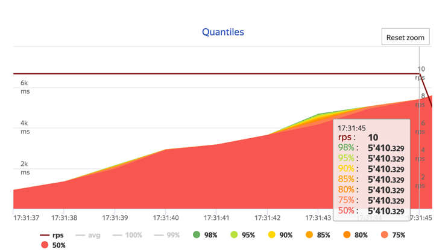

# ДЗ 2
## Метод тестирования
В качестве инструмента тестирования была выбран инструмент yandex tank.

### До применения индекса

* Тест: 10 секунд 1rps константно

* Тест: 10 секунд 10rps константно

* Тест: 10 секунд 100rps константно. На этом тест закончил, как видно, без индекса больше rps не тянет

### После применения индекса

Сделал индекс по двум полям first_name и last_name. Тип -- дефолтный btree, т.к. LIKE по префиксу в данном случае - операция сравнения:

* Explain: 
  `id,select_type,table,partitions,type,possible_keys,key,key_len,ref,rows,filtered,Extra
  1,SIMPLE,users,,range,users_name,users_name,404,,1,11.11,Using index condition`

* Тест: 10 секунд 1rps константно

* Тест: 10 секунд 10rps константно

* Тест: 10 секунд 100rps константно.

* Тест: 10 секунд 1000rps константно.

