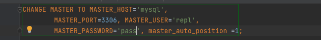

## 1. Настройка ассихнронной репликации
  * Добавим +1 реплику в docker-compose 

    
  * На мастере создаем пользователя для репликации (выполнял на поднятой базе)

    
  * На реплике создаем конфиг мастера (на скрине должен был быть вариант с бинлогом, но я его стер ¯\_(ツ)_/¯ )

    
  * Включаем слейв

    
  * Тут должен был быть скрин с show slave status, но я не успел его сделать с бинлогом ¯\_(ツ)_/¯ 

## 2. Нагрузочный тест
  * Пустим нагрузку на мастер (вывод -- нагрузка пошла)

    
  * Пустим нагрузку на реплику (к сожалению ничего умнее поменять урл до базы я не придумал)
     Нагрузка на реплику

    
     Нагрузка на мастер

    
    Вывод -- нагрузка ушла в реплику

## 3. Настройка row-based GTID и 2 слейва
   * Добавляем +1 слейв (тривиально)
   * Переношу данные дампом на него (с помощью IDE)
   * В конфиге мастера вклчючаем row_based и GTID 

     
   * В конфигах реплик проделываем то же самое.
   * Стопим репликацию, меняем на auto_position в мастере

     
   * Смотрим, что теперь репликация в GTID режиме
     
     
   * Установка и включение semi-sync. Мастер, на репликах аналогично, но с master -> slave
    

## 3. Эксперимент с нагрузкой и потерей данных
   * Пустим нагрузку с регистрацией

   
   * Убиваю инстанс с docker kill (по идее то же самое, что просто kill), ожидаемо приложение не может записать

     
   * Я добавил счетчик, но по итогу просто посмотреть через count(*), сколько записалось
   * Master

        
   * Slave 1

        
   * Slave 2

        
   * Вывод -- в свежий слейв транзации не потерялись, во 2 слейв несколько транзакций потерялось.
   * Переключение свежего слейва на мастер делал так. 2 слейв переключил тривиально, как и выше, но с лругим урлом

        

   Так как я много эксперементировал с выполнением команд на поднятой базе, то просто приложу весь код из data-grip, который остался.