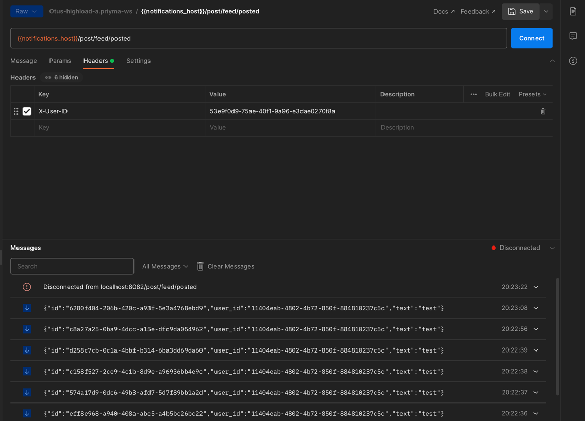

## Редис

При создании поста пишем в эксчендж с routing_key - id друга
Нотификации обрабатываем в отдельном сервисе
Direct байндинг создается при подключении пользователя по ws (т.е. очередь на каждого пользователя)

make docker_up

Коллекция rest запросов лежит в корне.
К сожалению websocket коллекция не шарится, поэтому так:
