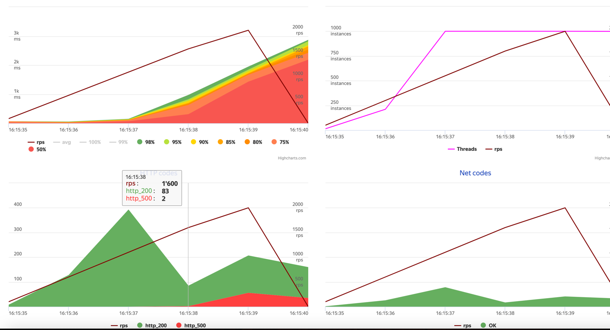
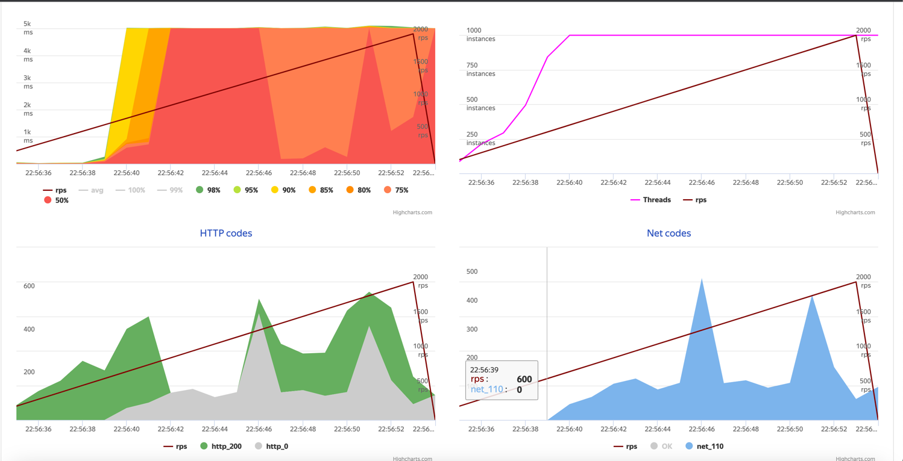
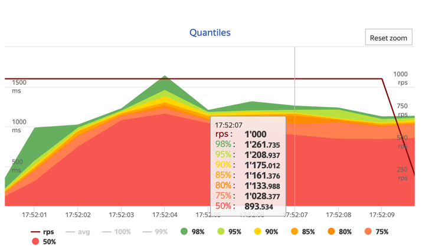

Для теста был выбрал модуль с пользователями. 
* Создал новый репозиторий с тарантулом(не переносил отношения дружбы)
* Попробовал потестить яндекс танком

На создание пользователя
* MYSQL:  на 1600 rps начинает 500-ть БД
* Tarantool: Тут картинка интерснее. База не 500-тит, но при это начинает таймаутить (10 секунд) на 600rps.

На поиск пользователя:
* MYSQL:  (из ДЗ 2). До 100 RPS работает нормально. Потом растет тайминг и появляются 500 (см. hw2)
* TARANTOOL: Ситуация аналогично записи. Тайминги растут на ~1000rps, но не 500.

Код [приложения](https://github.com/antonpriyma/otus-highload/blob/c48ac7726b991fea637d39336aa55116e9d9427a/build/tarantool/app.lua) тарантула.