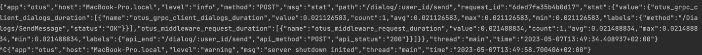
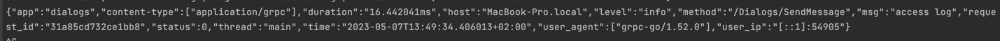

Для выноса в отдельный сервис были выбраны диалоги. 
Так как внутренних походов не было, для учебных целей я просто вынес отдельный сервис и стал проксировать REST запросы в него.

Выносить таблицу в отдельную базу не стал, т.к. в целом тут нет необходимости. В моем, случае, например, важна консистентность с таблицей юзеров.

Для трейсинга я написал (на самом деле еще до этого) набор [интерсепторов](https://github.com/antonpriyma/otus-highload/tree/5468395575c7a0c32bd4c0640c231fb0541f698d/pkg/framework/grpc).

Сервис поднимается отдельным бинарником и слушает на отдельном порте.
Пример похода:

Клиент:

Сервер: 

Как видно, request_id пробрасывается. 
