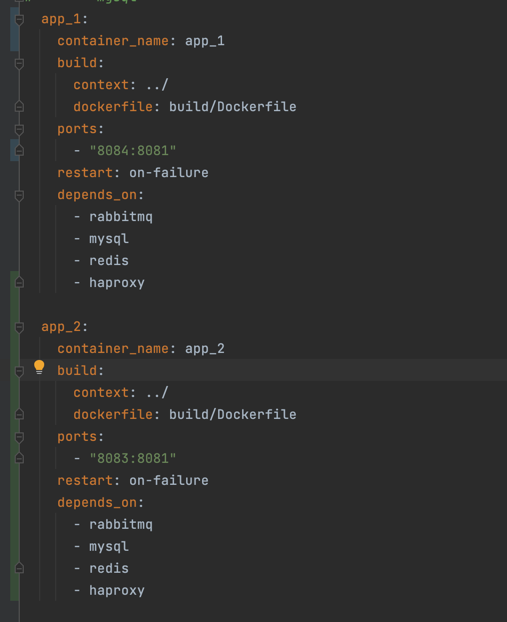
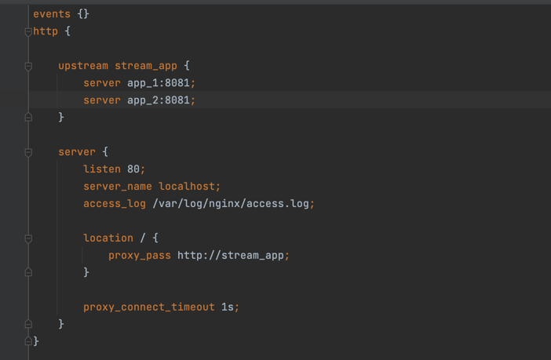
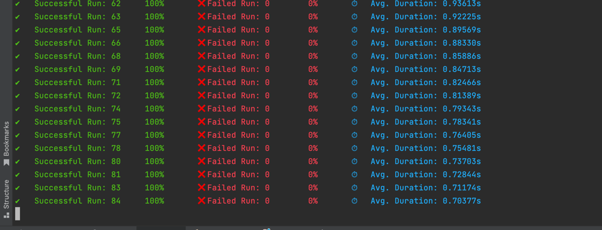
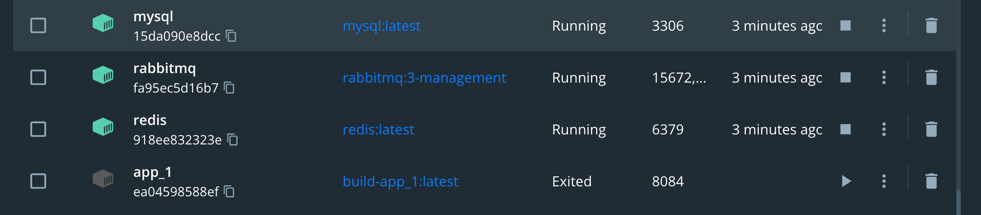
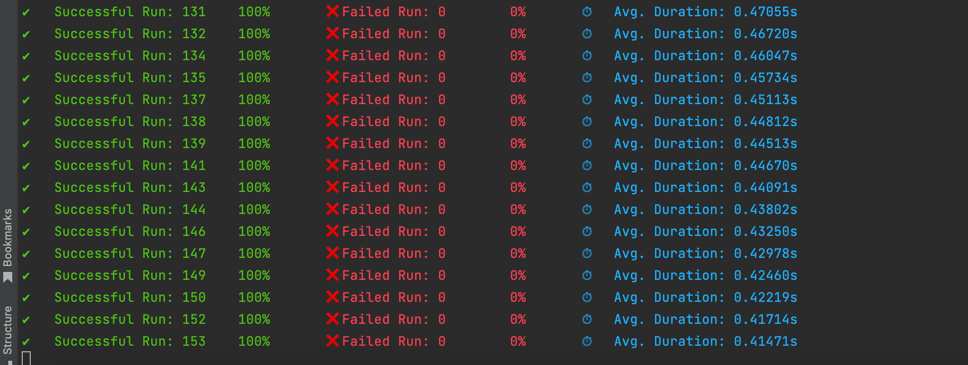
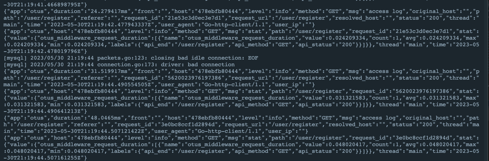
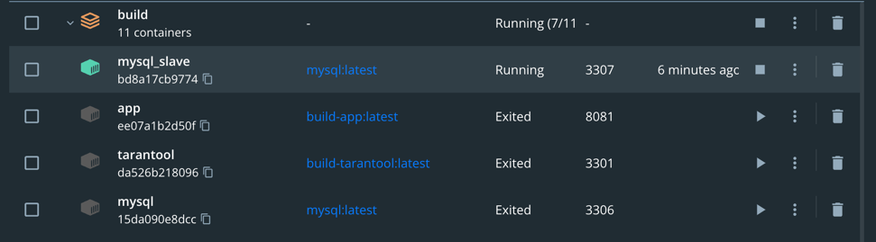
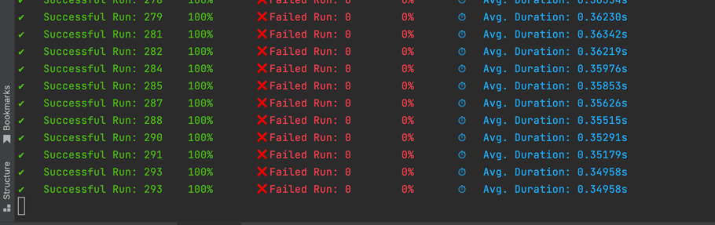
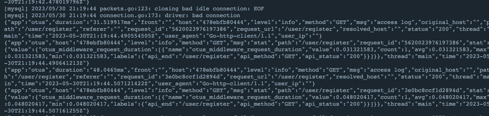

1. Поднимаем 2 реплику сервиса

2. Делаем nginx конфиг. Тут все базово, просто 2 сервиса и round robin

3. MYSQL подняты с 3 домашки, т.е. 2 реплики уже есть
4. Кофигурируем haproxy (пришлось повозиться с авторизацией mysql)

5. Пускаем нагрузку. Для этого я использовал тулзу ddosify

6. Выключаем 1 приложение, нагрузка попадает на 2 и ничего не ломается

7. Повторяем то же самое с базой. Все работает
  